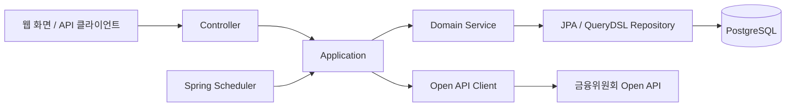

# Findex

**가볍고 빠른 외부 API 연동 금융 분석 도구**

금융위원회 Open API에서 국내 주가지수 정보를 수집하고, 지수별 시계열 데이터와 성과를 조회하는 서비스입니다.


## 팀 소개 — [ssibssaggi](https://github.com/ssibssaggi)

[프로젝트 저장소](https://github.com/ssibssaggi/sb14-findex-ssibssaggi) · [기여 내역](https://github.com/ssibssaggi/sb14-findex-ssibssaggi/graphs/contributors)

| 은솔 | 박수민 | 김수영 | 김세중 | 이현석 |
| :---: | :---: | :---: | :---: | :---: |
|  |  |  |  |  |
| [EUNSOLY](https://github.com/EUNSOLY) | [ssoomni52](https://github.com/ssoomni52) | [Ssu126](https://github.com/Ssu126) | [SB-14-KSJ](https://github.com/SB-14-KSJ) | [giseo1107](https://github.com/giseo1107) |
| 지수 정보 관리<br>차트·랭킹·공통 API | Open API 연동<br>연동 이력·자동 수집 | 지수 데이터 CRUD<br>목록 조회 | 대시보드 구성<br>관심 지수 성과 조회 | CSV 내보내기<br>조회·정렬 처리 |

## 기술 스택

| 구분 | 기술 | 용도 |
| --- | --- | --- |
| 언어 | Java 17 | 백엔드 구현 |
| 프레임워크 | Spring Boot 4.1.1, Spring Web MVC | REST API, 정적 웹 화면 제공 |
| 데이터 접근 | Spring Data JPA, QueryDSL 5.0.0 | 엔티티 관리, 동적 검색·정렬, 커서 페이지네이션 |
| 데이터베이스 | PostgreSQL | 지수 정보·데이터·연동 이력 저장 |
| 외부 API 연동 | Spring RestClient | 금융위원회 주가지수 Open API 호출 |
| 자동 수집 | Spring Scheduling | 자동 연동 대상 지수의 주기적 수집 |
| API 문서 | springdoc-openapi 3.0.3 | OpenAPI 명세, Swagger UI |
| CSV | OpenCSV 5.9 | 지수 데이터 파일 내보내기 |
| 개발 도구 | Lombok, Gradle Wrapper 9.7.1 | 반복 코드 축소, 빌드 |
| 코드 품질 | Checkstyle 10.12.4 | 코드 스타일 검사 |

## 주요 기능

| 기능 | 설명 |
| --- | --- |
| 지수 정보 관리 | 지수 등록·조회·수정·삭제, 분류명·지수명 검색, 즐겨찾기 설정, 요약 목록 조회 |
| 지수 데이터 관리 | 기준일별 시가·종가·고가·저가, 등락률, 거래량·거래대금·시가총액 관리 |
| Open API 연동 | 지수 정보 수집, 선택한 지수와 날짜 범위의 데이터 수집, 기존 데이터 갱신 |
| 연동 이력 조회 | 작업 유형·지수·대상 날짜·작업 시각·작업자·결과에 따른 검색 |
| 자동 연동 | 지수별 활성화 설정, 마지막 저장 기준일 이후 데이터 수집 |
| 대시보드 | 즐겨찾기 지수 성과, 기간별 성과·랭킹, 종가 및 MA5·MA20 차트 데이터 조회 |
| CSV 내보내기 | 지수·기간 필터와 정렬을 적용한 데이터 다운로드, UTF-8 BOM 적용 |
| 목록 탐색 | 지수 정보·데이터·연동 이력·자동 연동 설정의 커서 페이지네이션 |

웹 화면 빌드 결과물이 `src/main/resources/static`에 포함되어 있어 백엔드 실행 후 함께 사용할 수 있습니다.

## 팀원별 구현 기능 상세

### 은솔 — 지수 정보 관리와 대시보드

- 지수 정보 등록·단건 조회·수정·삭제 및 요약 목록 조회를 구현했습니다.
- 분류명·지수명·즐겨찾기 필터, 정렬, 커서 페이지네이션을 적용했습니다.
- 지수 삭제 시 연결된 지수 데이터와 연동 이력을 정리하도록 처리했습니다.
- 지수 성과 랭킹과 종가·MA5·MA20 차트 조회를 구현하고, 관심 지수 성과 조회 로직을 함께 완성했습니다.
- 공통 페이지 응답과 전역 예외 처리, Swagger 명세를 구성했습니다.

관련 PR: [지수 정보 조회](https://github.com/ssibssaggi/sb14-findex-ssibssaggi/pull/21), [성과 랭킹](https://github.com/ssibssaggi/sb14-findex-ssibssaggi/pull/27), [차트 조회](https://github.com/ssibssaggi/sb14-findex-ssibssaggi/pull/31), [Swagger](https://github.com/ssibssaggi/sb14-findex-ssibssaggi/pull/45)

**사진·GIF:** 자료 추가 예정 — 지수 검색·즐겨찾기 변경과 대시보드 차트 조회 화면

<!-- 화면 자료를 추가한 뒤 아래 이미지 문법의 주석을 해제합니다.

-->

### 박수민 — Open API 연동과 자동 수집

- RestClient를 사용해 지수 정보와 날짜별 지수 데이터를 수집했습니다.
- 지수 분류명·지수명을 확인하고, 기존 데이터가 있으면 갱신하는 upsert 처리를 구현했습니다.
- 작업 유형·지수·기간·작업자·결과별 연동 이력 조회와 커서 페이지네이션을 구현했습니다.
- 지수별 자동 연동 활성화 설정과 마지막 저장일 이후 데이터를 수집하는 스케줄러를 구현했습니다.
- 연동 데이터와 성공 이력 저장을 별도 트랜잭션으로 묶고, 처리된 호출 실패의 이력 저장을 추가했습니다.
- Checkstyle, Git Hook, IntelliJ 공통 코드 스타일을 구성했습니다.

관련 PR: [지수 정보 연동](https://github.com/ssibssaggi/sb14-findex-ssibssaggi/pull/15), [연동 이력](https://github.com/ssibssaggi/sb14-findex-ssibssaggi/pull/25), [자동 연동 설정](https://github.com/ssibssaggi/sb14-findex-ssibssaggi/pull/34), [스케줄러](https://github.com/ssibssaggi/sb14-findex-ssibssaggi/pull/38), [실패 처리](https://github.com/ssibssaggi/sb14-findex-ssibssaggi/pull/46)

**사진·GIF:** 자료 추가 예정 — 수동 연동 실행, 결과 이력 조회, 자동 연동 설정 변경 화면

<!--

-->

### 김수영 — 지수 데이터 관리

- 일별 지수 데이터의 등록·수정·삭제와 목록 조회를 구현했습니다.
- 지수와 기준일의 중복을 확인하고, 등록된 지수 정보에 데이터를 연결했습니다.
- 지수·날짜 범위 필터, 수치별 정렬과 커서 페이지네이션을 적용했습니다.
- 요청·응답 DTO와 엔티티를 구성하고, 데이터베이스 저장 흐름을 연결했습니다.

관련 PR: [엔티티 구성](https://github.com/ssibssaggi/sb14-findex-ssibssaggi/pull/1), [등록·수정·삭제](https://github.com/ssibssaggi/sb14-findex-ssibssaggi/pull/28), [목록 조회](https://github.com/ssibssaggi/sb14-findex-ssibssaggi/pull/35)

**사진·GIF:** 자료 추가 예정 — 지수 데이터 등록·수정·삭제와 기간별 목록 조회 화면

<!--

-->

### 김세중 — 관심 지수 성과 조회

- 대시보드용 컨트롤러와 응답 DTO의 초기 구성을 담당했습니다.
- 즐겨찾기 지수 ID와 지수별 최근 기준일을 조회하는 흐름을 구성했습니다.
- 현재 종가와 비교 기간의 데이터를 연결하는 관심 지수 성과 조회를 은솔과 함께 구현했습니다.
- 대시보드 컨트롤러·애플리케이션 통합과 수치 타입 정리를 진행했습니다.

관련 PR: [관심 지수 성과 조회 및 통합](https://github.com/ssibssaggi/sb14-findex-ssibssaggi/pull/36)

**사진·GIF:** 자료 추가 예정 — 관심 지수 현황과 일간·주간·월간 성과 조회 화면

<!--

-->

### 이현석 — 지수 데이터 CSV 내보내기

- 지수와 날짜 범위로 내보낼 데이터를 조회하고, 선택한 정렬 조건을 적용했습니다.
- 내보내기용 DTO와 CSV 다운로드 API를 구현했습니다.
- 시가·종가·고가·저가·등락률·거래량 등 지수 수치를 CSV 파일로 출력하도록 구성했습니다.
- 내보내기 조회와 응답 처리의 계층을 분리했습니다. 이후 공통 CSV 유틸리티 정리는 은솔이 함께 진행했습니다.

관련 PR: [CSV 내보내기](https://github.com/ssibssaggi/sb14-findex-ssibssaggi/pull/39)

**사진·GIF:** 자료 추가 예정 — 필터·정렬 적용 후 CSV 다운로드와 파일 내용 확인 화면

<!--

-->

## 파일 구조

```text
sb14-findex-ssibssaggi/
├── .github/                 # 이슈·PR 템플릿
├── config/                  # Checkstyle, IntelliJ 공통 설정
├── docs/
│   └── retrospective.md     # 개발 이력 기반 회고 초안
├── gradle/                  # Gradle Wrapper, IDE 설정 작업
├── scripts/                 # pre-commit, commit-msg Hook
├── src/
│   ├── main/
│   │   ├── java/com/ssibssaggi/findex/  # 백엔드 소스
│   │   └── resources/
│   │       ├── application.yaml        # DB, API, 스케줄 설정
│   │       └── static/                 # 웹 화면 빌드 결과물
│   └── test/               # 애플리케이션 테스트
├── .env.example             # 환경변수 예시
├── build.gradle             # 의존성과 빌드 작업
└── README.md                # 프로젝트 소개
```

백엔드 소스는 다음과 같이 구성합니다.

```text
src/main/java/com/ssibssaggi/findex
├── application          # 유스케이스 조합, 트랜잭션, 응답 데이터 구성
│   ├── index            # 지수 정보·데이터 관리, 대시보드
│   └── indexintegration # 수동·자동 연동, 데이터·이력 저장
├── client/openapi       # 외부 API 호출과 응답 DTO
├── common               # 공통 응답, 예외 처리, CSV 유틸리티
├── config               # QueryDSL, Swagger, RestClient, 스케줄러
├── controller           # REST API, 요청·응답 DTO, Swagger 명세
├── domain
│   ├── entity           # 지수 정보·데이터, 자동 연동 설정, 연동 이력
│   ├── service          # 도메인 처리
│   └── support          # 등락률 계산 등 공통 도메인 로직
└── repository           # JPA 저장소와 QueryDSL 조회 구현
```



`IndexInformation`을 중심으로 `IndexData`, `IntegrationHistory`가 연결되며, 지수마다 하나의 `AutoSyncConfig`를 가집니다. 지수 정보를 삭제하면 연결된 데이터와 연동 이력을 먼저 삭제하고 자동 연동 설정도 함께 제거합니다.

## 구현 홈페이지

| 구분 | 주소·상태 |
| --- | --- |
| 배포 홈페이지 | 배포 URL 추가 필요 |
| 로컬 홈페이지 | [http://localhost:8080/](http://localhost:8080/) — 백엔드 실행 후 접속 |
| 로컬 API 문서 | [Swagger UI](http://localhost:8080/swagger-ui/index.html) |

| 화면 | 이용 흐름 |
| --- | --- |
| 대시보드 | 관심 지수 성과 확인 → 기간 선택 → 종가·이동평균 차트 및 성과 랭킹 조회 |
| 지수 정보 관리 | 지수 검색 → 상세 정보 확인 → 정보 수정·즐겨찾기 관리 |
| 지수 데이터 관리 | 지수·기간 선택 → 데이터 조회·관리 → CSV 다운로드 |
| 연동 작업 관리 | 수동 연동 실행 → 작업 이력 확인 → 자동 연동 설정 |

## 프로젝트 회고록 및 발표자료

| 자료 | 링크·상태 |
| --- | --- |
| 프로젝트 회고록 | [개발 이력 기반 회고 초안](docs/retrospective.md) |
| 발표자료 | PDF·PPTX 첨부 또는 발표자료 링크 추가 필요 |
| 시연 영상 | 영상 파일 또는 링크 추가 필요 |

회고 초안에는 중복 연동 처리, 커서 페이지네이션, 트랜잭션 분리, 협업 규칙을 정리했습니다. 팀원별 회고와 발표자료는 최종 자료를 확인한 뒤 연결합니다.

<!-- 발표자료 파일을 추가한 뒤 아래 링크의 주석을 해제합니다.
[발표자료 PDF](docs/presentation.pdf)
-->

## 시작하기

### 1. 준비 사항

- JDK 17
- 실행 중인 PostgreSQL 서버와 접속 가능한 데이터베이스
- 금융위원회 주가지수 Open API 이용 신청 후 발급받은 인증키

Gradle은 저장소에 포함된 Wrapper를 사용합니다.

### 2. 저장소 받기

```bash
git clone https://github.com/ssibssaggi/sb14-findex-ssibssaggi.git
cd sb14-findex-ssibssaggi
```

### 3. 데이터베이스와 환경변수 설정

PostgreSQL에 사용할 데이터베이스를 생성합니다. 다음은 로컬 서버의 `postgres` 계정으로 `findex` 데이터베이스를 만드는 예시입니다.

```bash
createdb -h localhost -U postgres findex
```

[.env.example](.env.example)을 복사한 뒤 접속 정보와 인증키를 입력합니다.

```bash
cp .env.example .env
```

```properties
DB_URL=jdbc:postgresql://localhost:5432/findex
DB_USERNAME=postgres
DB_PASSWORD=your_database_password
API_KEY=your_decoding_service_key
AUTO_SYNC_CRON=0 0 1 * * *
```

| 변수 | 설명 |
| --- | --- |
| `DB_URL` | PostgreSQL JDBC 접속 주소 |
| `DB_USERNAME` | 데이터베이스 사용자 이름 |
| `DB_PASSWORD` | 데이터베이스 비밀번호 |
| `API_KEY` | Open API 인증키. URI 빌더에서 인코딩하므로 Decoding 키 입력 |
| `AUTO_SYNC_CRON` | 자동 연동용 cron 설정값. 현재 스케줄러에는 적용되지 않음 |

`.env`는 Java properties 형식으로 읽으므로 값을 따옴표 없이 작성합니다. 이 파일은 `.gitignore`에 등록되어 있습니다.

현재 [application.yaml](src/main/resources/application.yaml)의 `spring.config.import`는 `optional:.env`입니다. `.env`를 설정 파일로 읽을 수 있도록 해당 값을 다음과 같이 변경합니다. `[.properties]`는 파일 형식을 알려주는 확장자 힌트입니다. [Spring Boot 설정 파일 문서](https://docs.spring.io/spring-boot/reference/features/external-config.html#features.external-config.files.importing-extensionless-files)

```yaml
spring:
  config:
    import: "optional:file:.env[.properties]"
```

### 4. 실행

설정을 완료한 뒤 프로젝트 루트에서 실행합니다.

```bash
./gradlew bootRun
```

IntelliJ에서는 작업 디렉터리를 프로젝트 루트로 지정하고 `FindexApplication`을 실행합니다.

| 접속 대상 | 주소 |
| --- | --- |
| 웹 화면 | [http://localhost:8080/](http://localhost:8080/) |
| Swagger UI | [http://localhost:8080/swagger-ui/index.html](http://localhost:8080/swagger-ui/index.html) |
| OpenAPI JSON | [http://localhost:8080/v3/api-docs](http://localhost:8080/v3/api-docs) |

현재 JPA 설정은 `ddl-auto: update`이며, 애플리케이션 실행 시 엔티티를 기준으로 테이블 구조를 갱신합니다.

### 5. 첫 데이터 연동

1. 웹 화면 또는 `POST /api/sync-jobs/index-infos`로 지수 정보를 연동합니다.
2. 지수 목록에서 ID를 확인한 뒤 `POST /api/sync-jobs/index-data`에 지수 ID 목록과 수집 기간을 전달합니다.
3. 연동 이력에서 결과를 확인하고, 지수 데이터와 대시보드를 조회합니다.
4. 지속적으로 수집할 지수는 자동 연동 설정을 활성화합니다. 지수 등록 시 기본값은 비활성화입니다.

지수 데이터 연동 요청의 본문 예시입니다. ID와 날짜는 등록된 지수 및 수집할 기간에 맞게 변경합니다.

```json
{
  "indexInfoIds": [1, 2],
  "baseDateFrom": "2026-09-01",
  "baseDateTo": "2026-09-10"
}
```

> 현재 자동 연동은 `@Scheduled(fixedRate = 10000)`으로 **10초 주기**로 실행됩니다. `AUTO_SYNC_CRON`을 사용하는 어노테이션은 주석 처리되어 있으므로, 환경변수만 변경해도 실행 주기가 바뀌지는 않습니다. 설정 위치: [AutoSyncSchedulingConfig.java](src/main/java/com/ssibssaggi/findex/config/AutoSyncSchedulingConfig.java).

### 6. 빌드와 검사

위의 환경변수를 설정한 터미널에서 실행합니다.

```bash
# 테스트 및 Checkstyle 검사를 포함한 빌드
./gradlew build

# 테스트
./gradlew test

# 코드 스타일 검사
./gradlew checkstyleMain checkstyleTest
```

현재 테스트는 Spring 애플리케이션 컨텍스트를 로딩하므로 DB 연결과 환경변수 설정이 필요합니다.

## API 안내

상세 요청·응답 형식은 실행 후 Swagger UI에서 확인할 수 있습니다.

| 영역 | 메서드 | 경로 | 설명 |
| --- | --- | --- | --- |
| 지수 정보 | `GET`, `POST` | `/api/index-infos` | 목록 조회, 등록 |
| 지수 정보 | `GET`, `PATCH`, `DELETE` | `/api/index-infos/{id}` | 단건 조회, 수정, 삭제 |
| 지수 정보 | `GET` | `/api/index-infos/summaries` | 지수 요약 목록 |
| 지수 데이터 | `GET`, `POST` | `/api/index-data` | 목록 조회, 등록 |
| 지수 데이터 | `PATCH`, `DELETE` | `/api/index-data/{id}` | 수정, 삭제 |
| 지수 데이터 | `GET` | `/api/index-data/export/csv` | CSV 다운로드 |
| 대시보드 | `GET` | `/api/index-data/performance/favorite` | 즐겨찾기 지수 성과 |
| 대시보드 | `GET` | `/api/index-data/performance/rank` | 지수 성과 랭킹 |
| 대시보드 | `GET` | `/api/index-data/{id}/chart` | 지수 정보 ID에 해당하는 종가·이동평균 차트 |
| 연동 | `POST` | `/api/sync-jobs/index-infos` | 지수 정보 연동 |
| 연동 | `POST` | `/api/sync-jobs/index-data` | 지수 데이터 연동 |
| 연동 | `GET` | `/api/sync-jobs` | 연동 작업 이력 조회 |
| 자동 연동 | `GET` | `/api/auto-sync-configs` | 설정 목록 조회 |
| 자동 연동 | `PATCH` | `/api/auto-sync-configs/{id}` | 자동 연동 활성화 여부 수정 |

커서 페이지네이션 응답에는 `content`, `nextCursor`, `nextIdAfter`, `size`, `totalElements`, `hasNext`가 포함됩니다. 다음 페이지는 응답의 `nextCursor`와 `nextIdAfter`를 각각 요청의 `cursor`, `idAfter`로 전달하고, 필터와 정렬 조건을 유지해 조회합니다.

지수 데이터 목록의 지수 필터는 `indexInfoId`, CSV 다운로드의 지수 필터는 `indexInformationId`입니다.

## 주요 구현

### QueryDSL과 커서 페이지네이션

분류명·지수명·즐겨찾기·기간 등 선택적 검색 조건을 QueryDSL로 구성합니다. 정렬값인 `cursor`와 `Long` 타입 ID인 `idAfter`를 함께 사용해 같은 정렬값을 가진 행을 구분합니다. 요청 크기보다 한 건 더 조회하여 다음 페이지의 존재 여부를 판단합니다.

### 외부 데이터 갱신과 증분 수집

지수 정보는 분류명과 지수명, 지수 데이터는 지수 정보와 기준일을 기준으로 기존 데이터를 갱신하거나 새로 저장합니다. 자동 연동은 활성화된 지수의 마지막 저장 기준일 다음 날부터 어제까지를 대상으로 합니다. 저장된 데이터가 없는 지수는 최근 7일을 최초 수집 범위로 사용합니다.

### 지수 데이터와 연동 이력의 트랜잭션

`IndexDataSyncService`를 별도 빈으로 분리하고 `REQUIRES_NEW` 트랜잭션에서 지수 데이터와 성공 이력을 함께 저장합니다. 외부 호출에서 처리한 `CustomException`은 실패 대상으로 모아 요청 기간의 날짜별 실패 이력을 기록합니다.

### 금융 수치 계산과 CSV 출력

가격과 등락률 계산에 `BigDecimal`을 사용하며, 등락률은 소수점 둘째 자리까지 반올림합니다. 차트 응답에는 종가와 MA5·MA20 데이터가 포함됩니다. CSV는 화면의 페이지 크기에 제한받지 않고 필터에 맞는 데이터를 내보내며, 한글 헤더와 UTF-8 BOM을 적용합니다.

## 개발 규칙

### 공통 설정 설치

```bash
# 커밋 전 Checkstyle 검사와 커밋 메시지 검사 설치
./gradlew updateGitHook

# IntelliJ 프로젝트를 닫은 상태에서 공통 코드 스타일과 저장 시 정리 설정 설치
./gradlew installIntellijCodeStyle
```

Checkstyle은 저장소의 [google_checks.xml](config/checkstyle/google_checks.xml)을 사용하며, 허용 경고 수는 0개입니다.

### 커밋 메시지

```text
<이모지><타입>(선택 범위): <제목>
```

| 타입 | 용도 | 예시 |
| --- | --- | --- |
| `✨feat` | 신규 기능 | `✨feat(index): 지수 조회 기능 추가` |
| `🐛fix` | 버그 수정, 리팩토링, 코드 수정 | `🐛fix(sync): 연동 이력 저장 오류 수정` |
| `🔧chore` | 환경설정, 빌드, 의존성, 문서 | `🔧chore(readme): 실행 가이드 작성` |

제목은 50자 이내의 명령형·현재형으로 작성합니다. 본문이 있으면 제목 다음 줄을 비우고 작성합니다.

## 관련 문서

- [프로젝트 회고록 초안](docs/retrospective.md)
- [환경변수 예시](.env.example)
- [애플리케이션 설정](src/main/resources/application.yaml)
- [Swagger 명세 인터페이스](src/main/java/com/ssibssaggi/findex/controller/swagger)
- [이슈 템플릿](.github/ISSUE_TEMPLATE/feature_request.md)
- [PR 템플릿](.github/PULL_REQUEST_TEMPLATE.md)
